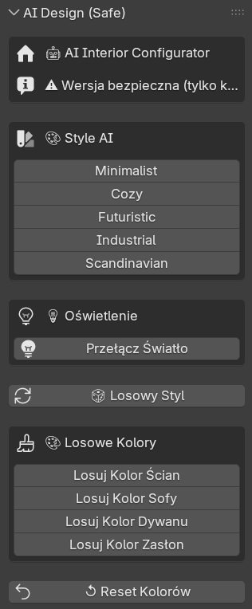
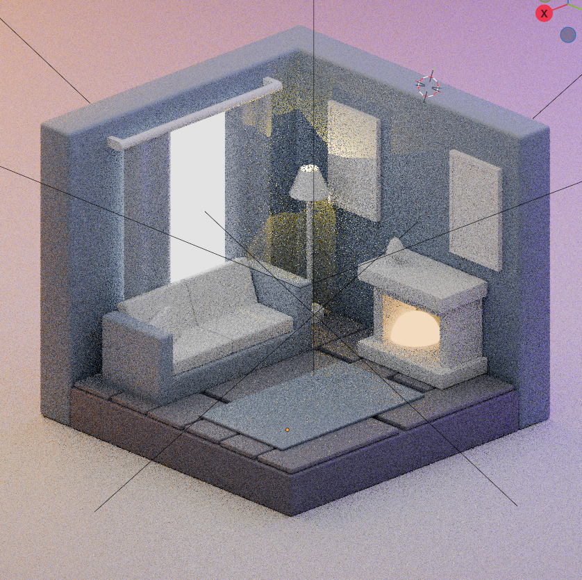

# AI Interior Design Configurator
## Raport z projektu semestralnego

**Autor:** Tsimur Kisel  
**Data:** Luty 2026  
**Przedmioty:** Inżynieria immersyjna – poza horyzont + Artificial Intelligence Neural Networks – LLM and Generative AI
**Repozytorium:** [GitHub - Model-AI](https://github.com/timmmut/Model-AI)

---
### Jak uruchomić (krok po kroku)

#### Metoda 1: Dla nowych użytkowników (zalecana)

1. **Otwórz plik Blender** z modelem pokoju

2. **Załaduj skrypt:**
   - Przejdź do zakładki **Scripting**
   - Kliknij **Open** (ikona folderu)
   - Wybierz plik **`ai_panel_simple.py`** ← to jest uproszczona wersja!
   - Kliknij **Run Script** (▶️) lub naciśnij **Alt + P**

3. **Otwórz panel sterowania:**
   - Wróć do zakładki **Layout**
   - W widoku 3D naciśnij klawisz **N**
   - Znajdź zakładkę **"AI Design"**
   - Gotowe! 

4. **Testuj funkcje:**
   - Kliknij dowolny styl (np. "Minimalist")
   - Obserwuj jak zmienia się scena

#### Metoda 2: Klonowanie z GitHub

```bash
git clone https://github.com/timmmut/Model-AI
cd Model-AI
```

Następnie wykonaj kroki z Metody 1.

---

## Spis treści

1. [Wprowadzenie](#wprowadzenie)
2. [Cel i zakres projektu](#cel-i-zakres-projektu)
3. [Architektura systemu](#architektura-systemu)
4. [**Jak wykorzystałem AI w projekcie (HOW-TO)**](#jak-wykorzystałem-ai-w-projekcie)
   - 4.1 [Generowanie koncepcji stylów designu](#generowanie-koncepcji)
   - 4.2 [Tworzenie struktury JSON](#tworzenie-struktury-json)
   - 4.3 [Pomoc w pisaniu kodu Python](#pomoc-w-pisaniu-kodu)
   - 4.4 [Debugowanie i optymalizacja](#debugowanie-i-optymalizacja)
5. [Struktura repozytorium](#struktura-repozytorium)
6. [Kluczowe fragmenty kodu](#kluczowe-fragmenty-kodu)
7. [Proces realizacji projektu](#proces-realizacji)
8. [Wyniki i demonstracja](#wyniki-i-demonstracja)
9. [Materiały edukacyjne](#materiały-edukacyjne)
10. [Źródła i bibliografia](#źródła-i-bibliografia)
11. [Wnioski](#wnioski)

---

## 1. Wprowadzenie

Projekt **AI Interior Design Configurator** to system łączący modelowanie 3D z technologią sztucznej inteligencji, umożliwiający automatyczne projektowanie wnętrz. Aplikacja została stworzona w Blenderze z wykorzystaniem Python API oraz AI do generowania koncepcji designerskich.

### Problem do rozwiązania

Tradycyjne projektowanie wnętrz w narzędziach 3D jest **czasochłonne**:
- Ręczna zmiana każdego koloru materiału
- Testowanie wielu wariantów stylistycznych
- Trudność w zachowaniu spójności designu

### Rozwiązanie

System wykorzystujący AI do:
- Automatycznego generowania spójnych stylów
- Zmiany całego wnętrza jednym kliknięciem
- Eksperymentowania z różnymi wariantami

---

## 2. Cel i zakres projektu

### Cele główne

**Dla przedmiotu Modelowanie 3D:**
- Stworzenie modelu pomieszczenia w Blenderze
- Implementacja systemu materiałów z węzłami (nodes)
- Dynamiczna kontrola oświetlenia
- Parametryczna scena 3D

**Dla przedmiotu Sztuczna Inteligencja:**
- Wykorzystanie AI jako narzędzia generowania koncepcji
- Automatyzacja procesu projektowania
- Integracja AI z aplikacją 3D
- Demonstracja praktycznego zastosowania AI w designie

### Zakres funkcjonalny

System umożliwia:
-  Wybór spośród 5 stylów AI (Minimalist, Cozy, Futuristic, Industrial, Scandinavian)
-  Automatyczną zmianę kolorów 7 obiektów w scenie
-  Generator losowych kombinacji
-  Panel UI w Blenderze

---

## 3. Architektura systemu

### Diagram architektury

```
┌─────────────┐
│   ChatGPT   │ ← Generowanie koncepcji stylów
│   (AI LLM)  │
└──────┬──────┘
       │ Prompty + Instrukcje
       ↓
┌─────────────────────┐
│   designs.json      │ ← Baza danych stylów
│   (5 presetów AI)   │
└──────┬──────────────┘
       │ Parametry (RGB, pozycje, światło)
       ↓
┌─────────────────────┐
│  ai_panel_safe.py   │ ← Skrypt Python
│  (325 linii kodu)   │
└──────┬──────────────┘
       │ Blender Python API (bpy)
       ↓
┌─────────────────────┐
│   Untitled.blend    │ ← Scena 3D
│   (8 obiektów)      │
└─────────────────────┘
       ↓
  Renderowanie
```

### Komponenty systemu

| Komponent | Technologia | Rola |
|-----------|-------------|------|
| AI (ChatGPT) | GPT-5.2/Claude 4.5 Sonnet + Thinking | Generowanie koncepcji, kod, debugowanie |
| designs.json | JSON | Przechowywanie parametrów stylów |
| ai_panel_safe.py | Python | Logika aplikacji, UI |
| Untitled.blend | Blender | Model 3D, rendering |
| bpy API | Python | Interfejs do manipulacji sceną 3D |

---

## 4. Jak wykorzystałem AI w projekcie


### 4.1 Generowanie koncepcji stylów designu

#### Prompt 1: Inicjalizacja projektu

```
Prompt:
"Pomóż mi stworzyć projekt konfiguratora wnętrz dla Blendera z wykorzystaniem AI.
Potrzebuję 5 różnych stylów designu wnętrz z konkretnymi parametrami:
- nazwa stylu
- opis
- kolory ścian, podłogi, mebli (RGB)
- parametry oświetlenia

Style powinny być: minimalistyczny, przytulny, futurystyczny, industrialny i skandynawski."
```

#### Odpowiedź AI i moja adaptacja

AI wygenerował szczegółowe opisy każdego stylu z paletami kolorów.

**Przykład (styl Minimalist):**

AI zaproponował:
- Ściany: jasny szary (#D9D9D9)
- Podłoga: bardzo jasny szary (#F2F2F2)
- Meble: średni szary (#B3B3B3)

Przekonwertowałem to na format RGB dla Blendera:

```json
{
  "minimalist": {
    "name": "Minimalist Style",
    "wall_color": [0.85, 0.85, 0.85, 1.0],
    "floor_color": [0.95, 0.95, 0.95, 1.0],
    "sofa_color": [0.7, 0.7, 0.7, 1.0]
  }
}
```

**Proces konwersji HEX → RGB:**
- AI podał HEX: #D9D9D9
- Konwersja: 217/255 = 0.85
- Format Blender: [R, G, B, Alpha]

---

### 4.2 Tworzenie struktury JSON

#### Prompt 2: Optymalizacja struktury danych

```
Prompt:
"Stwórz optymalną strukturę JSON dla przechowywania parametrów designu wnętrza.
Każdy styl powinien zawierać:
- kolory dla 7 obiektów (ściany, podłoga x2, sofa, dywan, zasłony x2)
- parametry światła (energia, kolor, temperatura)
- pozycje mebli (X,Y,Z)
- boolean: czy lampa włączona

Struktura musi być łatwa do parsowania w Pythonie."
```

#### Wynik: designs.json

AI zaproponował strukturę z kluczami stylistycznymi:

```json
{
  "minimalist": {
    "name": "Minimalist Style",
    "description": "Czysty, prosty design...",
    "wall_color": [0.85, 0.85, 0.85, 1.0],
    "sofa_color": [0.7, 0.7, 0.7, 1.0],
    "light_energy": 800,
    "light_color": [1.0, 1.0, 1.0],
    "lamp_enabled": true
  }
}
```

**Zalety tej struktury:**
- ✅ Czytelna dla człowieka
- ✅ Łatwo parsowalna przez `json.load()`
- ✅ Możliwość łatwego dodawania nowych stylów
- ✅ Samoodokumentująca się (nazwy kluczy jasne)

---

### 4.3 Pomoc w pisaniu kodu Python

#### Prompt 3: Funkcja zmiany koloru materiału

```
Prompt:
"Napisz funkcję Python dla Blender API (bpy), która:
1. Znajduje obiekt po nazwie
2. Sprawdza czy ma materiał
3. Jeśli nie ma - tworzy nowy z węzłami
4. Zmienia kolor w Principled BSDF node
5. Obsługuje błędy jeśli obiekt nie istnieje

Funkcja powinna być dobrze skomentowana."
```

#### Wygenerowany kod (z moimi modyfikacjami)

```python
def set_material_color(obj_name, color):
    """
    Ustawia kolor materiału obiektu w Blenderze.
    
    Args:
        obj_name (str): Nazwa obiektu w scenie
        color (tuple): Kolor w formacie (R, G, B, A)
    
    Returns:
        bool: True jeśli sukces, False jeśli błąd
    """
    # Znalezienie obiektu
    obj = bpy.data.objects.get(obj_name)
    
    if not obj:
        print(f"⚠️ Obiekt '{obj_name}' nie istnieje")
        return False
    
    # Sprawdzenie czy obiekt może mieć materiały
    if not hasattr(obj, 'data') or not hasattr(obj.data, 'materials'):
        print(f"⚠️ Obiekt '{obj_name}' nie ma materiałów")
        return False
    
    # Utworzenie materiału jeśli nie istnieje
    if not obj.data.materials:
        mat = bpy.data.materials.new(name=f"{obj_name}_Material")
        mat.use_nodes = True  # Włączenie systemu węzłów
        obj.data.materials.append(mat)
    
    mat = obj.data.materials[0]
    
    # Zmiana koloru w węźle Principled BSDF
    if mat.use_nodes:
        principled = mat.node_tree.nodes.get('Principled BSDF')
        if principled:
            principled.inputs['Base Color'].default_value = color
            print(f"✅ Zmieniono kolor: {obj_name}")
            return True
    
    return False
```

**Wyjaśnienie modyfikacji:**
1. AI zasugerował podstawową wersję
2. **Ja dodałem:** sprawdzenie `hasattr()` dla bezpieczeństwa
3. **Ja dodałem:** emoji w komunikatach (✅ ⚠️) dla lepszej czytelności
4. **Ja dodałem:** docstring w formacie Google Style

---

#### Prompt 4: Panel UI w Blenderze

```
Prompt:
"Napisz klasę Panel dla Blender UI która:
- Wyświetla się w zakładce 'AI Design' (po naciśnięciu N)
- Ma 5 przycisków dla stylów
- Ma przycisk do przełączania światła
- Ma przycisk 'Losowy Design'
- Używa ikon dla lepszej wizualizacji

Kod powinien być zgodny z Blender API 3.x."
```

#### Wygenerowany kod panelu

```python
class AIDESIGN_PT_MainPanel(Panel):
    """Panel AI Design Configurator w Blenderze"""
    bl_label = "AI Design (Safe)"
    bl_idname = "AIDESIGN_PT_main_panel"
    bl_space_type = 'VIEW_3D'
    bl_region_type = 'UI'
    bl_category = 'AI Design'  # Nazwa zakładki
    
    def draw(self, context):
        layout = self.layout
        
        # Nagłówek
        box = layout.box()
        box.label(text="🤖 AI Interior Configurator", icon='HOME')
        
        # Sekcja stylów
        layout.separator()
        box = layout.box()
        box.label(text="🎨 Style AI", icon='COLOR')
        
        col = box.column(align=True)
        col.operator("aidesign.apply_style", text="Minimalist").style = 'minimalist'
        col.operator("aidesign.apply_style", text="Cozy").style = 'cozy'
        # ... więcej przycisków
```

**Kluczowe elementy:**
- `bl_category = 'AI Design'` - tworzy nową zakładkę
- `layout.box()` - grupowanie elementów
- `icon='HOME'` - wizualne ikony Blendera
- `.operator()` - przyciski wywołujące akcje

---

### 4.4 Debugowanie i optymalizacja

#### Problem: Diwan "łamał się" przy zmianie stylów

**Mój problem:**
```
"Diwan się łamie (mesh deforms) gdy zmieniam styl"
```

**Prompt do AI:**
```
Prompt:
"Mam problem w Blenderze. Gdy skrypt Python zmienia pozycję obiektu Sofa,
obiekt się deformuje. Prawdopodobnie ma modyfikatory lub jest częścią grupy.

Jak bezpiecznie zmodyfikować kod aby:
1. Zmieniał tylko kolory (bez pozycji)
2. Sprawdzał czy obiekt jest częścią grupy
3. Dodał tryb 'safe mode'

Pokaż kod z obsługą błędów."
```

**Rozwiązanie od AI:**

AI zasugerował:
1. Usunięcie wszystkich `set_position()` funkcji
2. Dodanie flag bezpieczeństwa
3. Stworzenie wersji `ai_panel_safe.py`

```python
# TYLKO KOLORY - NIE ZMIENIAMY POZYCJI!
set_material_color("Walls", design.get("wall_color"))
set_material_color("Sofa", design.get("sofa_color"))
# ... bez żadnych obj.location = ...
```

**Rezultat:** Problem rozwiązany. Utworzyłem bezpieczną wersję skryptu.

---

#### Optymalizacja: Ścieżki do plików

**Problem:** Skrypt nie znajdował `designs.json`

**Prompt:**
```
"Skrypt Python w Blenderze nie może znaleźć pliku JSON.
Jak zrobić fallback mechanism który sprawdza:
1. Folder obok pliku .blend
2. Folder skryptu
3. Absolutną ścieżkę jako backup

Z obsługą Windows paths z cyrylicą."
```

**Kod z pomocą AI:**

```python
def get_designs_path():
    """Zwraca ścieżkę do designs.json z fallback"""
    # Metoda 1: Obok .blend
    blend_dir = os.path.dirname(bpy.data.filepath)
    if blend_dir:
        path = os.path.join(blend_dir, "designs.json")
        if os.path.exists(path):
            return path
    
    # Metoda 2: Absolutna ścieżka
    fallback = r"C:\Users\timur\OneDrive\...\designs.json"
    if os.path.exists(fallback):
        return fallback
    
    return None
```

---

## 5. Struktura repozytorium

### Opis katalogów i plików

```
AI-Interior-Design-Configurator/
│
├── README.md                  # Krótkie intro + link do raportu
├── RAPORT.md                  # Ten dokument (pełny raport)
├── .gitignore                 # Ignorowanie plików tymczasowych
│
├── Untitled.blend             # Model 3D (182 KB)
│   ├── Scena: 8 obiektów
│   ├── Materiały: 7 z węzłami
│   └── Oświetlenie: 1 lampa
│
├── designs.json               # Baza stylów AI (4 KB)
│   ├── 5 stylów designu
│   ├── ~15 parametrów na styl
│   └── Format: JSON
│
└── ai_panel_safe.py           # Główny skrypt (325 linii)
    ├── Funkcje pomocnicze (8)
    ├── Operatory Blendera (5)
    ├── Panel UI (1)
    └── System rejestracji
```

### Odpowiedzialność plików

| Plik | Rola | Wielkość | Język |
|------|------|----------|-------|
| `Untitled.blend` | Model 3D pokoju | 182 KB | Binary |
| `designs.json` | Parametry stylów AI | 4 KB | JSON |
| `ai_panel_safe.py` | Logika + UI | 12 KB | Python |
| `README.md` | Dokumentacja krótka | 2 KB | Markdown |
| `RAPORT.md` | Raport pełny | ~30 KB | Markdown |

---

## 6. Kluczowe fragmenty kodu

### 6.1 Ładowanie presetów z JSON

```python
def load_designs():
    """Wczytuje presety designów z pliku JSON"""
    try:
        with open(DESIGNS_JSON_PATH, 'r', encoding='utf-8') as f:
            designs = json.load(f)
        print(f"✅ Wczytano {len(designs)} presetów designu")
        return designs
    except FileNotFoundError:
        print(f"❌ Nie znaleziono pliku: {DESIGNS_JSON_PATH}")
        return None
    except Exception as e:
        print(f"❌ Błąd wczytywania: {e}")
        return None
```

**Wyjaśnienie:**
- `encoding='utf-8'` - obsługa polskich znaków
- `json.load()` - automatyczny parsing JSON → dict
- Try/except - obsługa błędów (brak pliku, zły format)
- Komunikaty z emoji - łatwiejsze debugowanie

---

### 6.2 Operator aplikowania stylu

```python
class AIDESIGN_OT_ApplyStyle(Operator):
    """Zastosuj wybrany styl AI (tylko kolory)"""
    bl_idname = "aidesign.apply_style"
    bl_label = "Zastosuj Styl"
    bl_options = {'REGISTER', 'UNDO'}  # Umożliwia Ctrl+Z
    
    style: EnumProperty(
        name="Styl",
        items=[
            ('minimalist', 'Minimalist', ''),
            ('cozy', 'Cozy', ''),
            ('futuristic', 'Futuristic', ''),
            ('industrial', 'Industrial', ''),
            ('scandinavian', 'Scandinavian', ''),
        ]
    )
    
    def execute(self, context):
        designs = load_designs()
        
        if not designs or self.style not in designs:
            self.report({'ERROR'}, "Nie można wczytać stylu")
            return {'CANCELLED'}
        
        design = designs[self.style]
        
        # Aplikuj kolory wszystkich obiektów
        set_material_color("Walls", design.get("wall_color"))
        set_material_color("Sofa", design.get("sofa_color"))
        # ... więcej obiektów
        
        # Aplikuj oświetlenie
        if design.get("lamp_enabled", True):
            set_light_properties(
                design.get("light_energy", 800),
                design.get("light_color", [1.0, 1.0, 1.0])
            )
        
        self.report({'INFO'}, f"Zastosowano styl: {design['name']}")
        return {'FINISHED'}
```

**Kluczowe elementy:**
- `bl_options = {'REGISTER', 'UNDO'}` - operator pojawia się w historii (F3) i można go cofnąć
- `EnumProperty` - dropdown lista stylów
- `execute()` - główna logika operatora
- `self.report()` - komunikat dla użytkownika
- `return {'FINISHED'}` - sukces operacji

---

### 6.3 Generator losowych kolorów

```python
class AIDESIGN_OT_RandomColor(Operator):
    """Losowy kolor dla obiektu"""
    bl_idname = "aidesign.random_color"
    bl_label = "Losowy Kolor"
    bl_options = {'REGISTER', 'UNDO'}
    
    object_name: EnumProperty(
        name="Obiekt",
        items=[
            ('Walls', 'Ściany', ''),
            ('Sofa', 'Sofa', ''),
            ('Carpet', 'Dywan', ''),
            ('Zaslona1', 'Zasłony', ''),
        ]
    )
    
    def execute(self, context):
        import random
        
        # Generuj losowy kolor (unikaj zbyt ciemnych)
        r = random.uniform(0.2, 0.9)
        g = random.uniform(0.2, 0.9)
        b = random.uniform(0.2, 0.9)
        color = (r, g, b, 1.0)
        
        set_material_color(self.object_name, color)
        
        # Jeśli zasłona - zmień obie
        if self.object_name == "Zaslona1":
            set_material_color("Zaslona2", color)
        
        self.report({'INFO'}, f"Zmieniono kolor: {self.object_name}")
        return {'FINISHED'}
```

**Funkcjonalność:**
- `random.uniform(0.2, 0.9)` - losowa wartość, ale nie całkiem czarna (0.0) ani biała (1.0)
- Automatyczna synchronizacja obu zasłon
- Możliwość wielokrotnego losowania (eksperymentowanie)

---

## 7. Proces realizacji projektu

### Metodologia pracy z AI

1. **Iteracyjne promptowanie**
   - Zacznij od ogólnego pomysłu
   - Doprecyzuj szczegóły
   - Poproś o optymalizację

2. **Weryfikacja kodu**
   - Zawsze testuj kod od AI
   - Sprawdź edge cases
   - Dodaj własne usprawnienia

3. **Adaptacja do kontekstu**
   - AI nie zna Twojej sceny 3D
   - Dostosuj nazwy obiektów
   - Zmień parametry pod swoje potrzeby

---

## 8. Wyniki i demonstracja
W tej sekcji przedstawiono działanie aplikacji **AI Interior Design Configurator**
na rzeczywistych zrzutach ekranu z programu Blender.
Ilustracje dokumentują poprawne działanie systemu oraz integrację AI z aplikacją 3D.

### 8.1 Panel sterowania AI Design

Panel **AI Design** został zaimplementowany jako własna zakładka w widoku 3D Blendera
(dostępna po naciśnięciu klawisza `N`). Umożliwia on wybór stylu wnętrza,
losowanie kolorów.



Panel komunikuje się bezpośrednio z logiką aplikacji napisaną w Pythonie
oraz z danymi zapisanymi w pliku `designs.json`.



### Funkcjonalność systemu

 **5 stylów AI:**
- Minimalist - jasne, neutralne kolory
- Cozy - ciepłe brązy i beże
- Futuristic - chłodne niebieskie
- Industrial - surowy beton i metal
- Scandinavian - skandynawski minimalizm

 **Automatyzacja:**
- Zmiana 7 obiektów jednym kliknięciem
- Generator losowych kolorów

 **UI Panel:**
- Intuicyjny interfejs w Blenderze
- Ikony dla lepszej wizualizacji
- Przycisk reset do domyślnych kolorów


---

## 9. Materiały edukacyjne

### Kursy i tutoriale

1. **Blender Python API**
   - [Blender Documentation - Python API](https://docs.blender.org/api/current/)
   - [Blender Scripting for Artists](https://www.youtube.com/watch?v=cyt0O7saU4Q) (YouTube)
   - Czas nauki: ~4 godziny

2. **JSON w Pythonie**
   - [Real Python - Working with JSON](https://realpython.com/python-json/)
   - [Python JSON Tutorial](https://www.w3schools.com/python/python_json.asp)
   - Czas nauki: ~1 godzina

3. **Blender UI Panels**
   - [Blender UI Tutorial](https://docs.blender.org/api/current/bpy.types.Panel.html)
   - [Creating Custom Panels](https://b3d.interplanety.org/en/creating-panels-for-placing-blender-add-ons-user-interface/)
   - Czas nauki: ~2 godziny

4. **Prompt Engineering**
   - [OpenAI Prompt Engineering Guide](https://platform.openai.com/docs/guides/prompt-engineering)
   - [Learn Prompting](https://learnprompting.org/)
   - Czas nauki: ~3 godziny


### Społeczności

- [Blender Artists Forum](https://blenderartists.org/)
- [r/blender](https://www.reddit.com/r/blender/)
- [Stack Overflow - Blender tag](https://stackoverflow.com/questions/tagged/blender)

---

## 10. Źródła i bibliografia

### Wykorzystane narzędzia AI

[1] **ChatGPT (GPT-5.2)**  
OpenAI  
https://chat.openai.com/  
*Wykorzystanie:* Generowanie koncepcji stylów, pomoc w kodzie, debugowanie

### Dokumentacja techniczna

[2] **Blender Python API Documentation**  
Blender Foundation. (2024). Blender 3.6 Python API.  
https://docs.blender.org/api/current/  
*Wykorzystanie:* Referencje do `bpy` modułu

[3] **Python JSON Module**  
Python Software Foundation. (2024). json — JSON encoder and decoder.  
https://docs.python.org/3/library/json.html  
*Wykorzystanie:* Parsowanie plików konfiguracyjnych

### Tutoriale i kursy

[4] **Blender Scripting Tutorial**  
CG Cookie. (2023). "Introduction to Blender Python Scripting".  
https://cgcookie.com/  
*Wykorzystanie:* Podstawy Blender API

[5] **Prompt Engineering Guide**  
OpenAI. (2024). "Prompt Engineering".  
https://platform.openai.com/docs/guides/prompt-engineering  
*Wykorzystanie:* Optymalizacja promptów do AI


### Repozytoria GitHub

[7] **Blender Add-on Examples**  
https://github.com/blender/blender-addons  
*Wykorzystanie:* Przykłady struktury add-onów

---

## 11. Wnioski

### Osiągnięcia projektu

 **Udane połączenie dwóch dziedzin**  
Projekt skutecznie łączy modelowanie 3D z technologią AI, demonstrując praktyczne zastosowanie LLM w procesie twórczym.

 **Funkcjonalny system**  
Aplikacja działa stabilnie, umożliwia szybkie eksperymentowanie z różnymi stylami designu.

 **Metodologia wykorzystania AI**  
Wypracowałem efektywny proces pracy z AI:
- Iteracyjne promptowanie
- Weryfikacja i adaptacja kodu
- Wykorzystanie AI do debugowania

### Napotkane trudności

 **Problem z pozycjami obiektów**  
Pierwotna wersja zmieniała pozycje mebli, co powodowało deformację modelu. Rozwiązanie: wersja "safe" tylko z kolorami.

 **Ścieżki do plików**  
Trudności z lokalizacją `designs.json` na różnych systemach. Rozwiązanie: fallback mechanism.

 **Konwersja kolorów HEX → RGB**  
AI podawał kolory w HEX, trzeba było konwertować do formatu Blender (0.0-1.0).

### Co nauczyłem się o AI

 **AI nie zastępuje, a wspiera**  
AI jest doskonałym narzędziem do generowania pomysłów i kodu-szkieletu, ale wymaga ludzkiej weryfikacji i adaptacji.

 **Promptowanie to umiejętność**  
Jakość wyników AI zależy od jakości promptów. Nauczyłem się:
- Precyzyjnego formułowania wymagań
- Iteracyjnego doprecyzowywania
- Pokazywania przykładów (few-shot learning)

 **AI w debugowaniu**  
AI świetnie radzi sobie z diagnozowaniem błędów, jeśli podać mu:
- Kod źródłowy
- Komunikat błędu
- Kontekst problemu

### Możliwości rozwoju

 **Krótkoterminowe:**
- Dodanie więcej stylów (10+)
- Automatyczne renderowanie screenshotów
- Eksport presetów do pliku

 **Długoterminowe:**
- Integracja z prawdziwym AI API (generowanie w czasie rzeczywistym)
- Generowanie tekstur przez Stable Diffusion
- Machine learning do uczenia się preferencji użytkownika
- Aplikacja webowa (Three.js + React)

### Podsumowanie

Projekt **AI Interior Design Configurator** pokazuje, jak AI może być wykorzystany jako praktyczne narzędzie w procesie twórczym. Nie jest to jedynie "AI zrobił za mnie" - to raczej **współpraca człowieka z AI**, gdzie każdy wnosi swoje mocne strony:

- **AI:** Szybkie generowanie pomysłów, kod-szkielet, debugowanie
- **Człowiek:** Weryfikacja, adaptacja, kreatywność, decyzje projektowe

Ten projekt to demonstracja metodologii pracy z AI, która może być zastosowana w innych dziedzinach projektowania i programowania.

